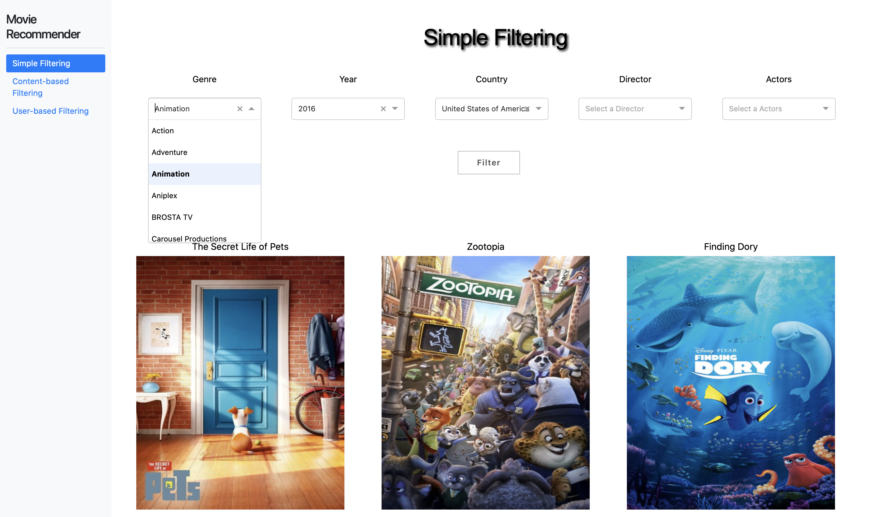
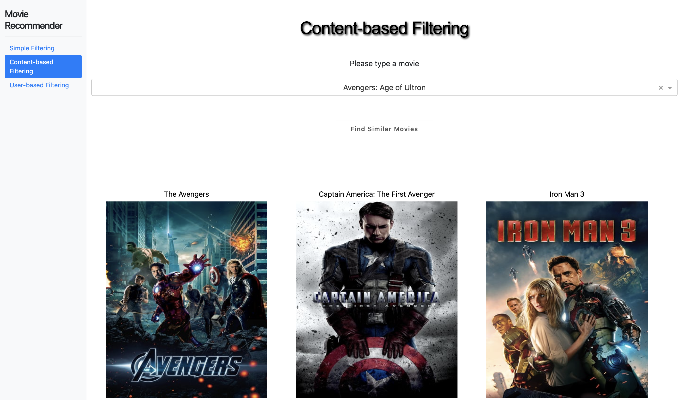
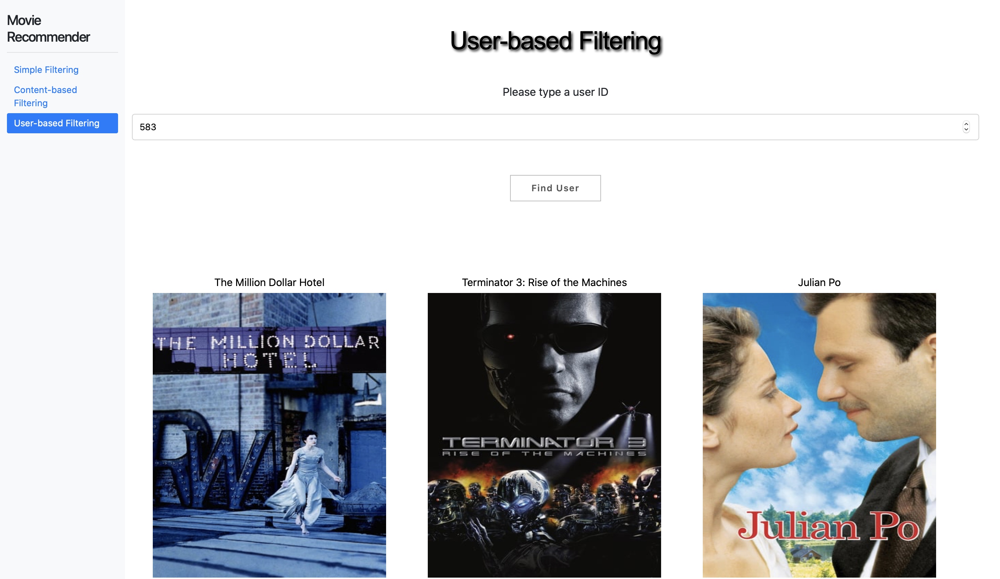

This file provides users detailed examples of how to use our interface and what they can do with the interface.

## Getting Started

Our interface mainly consists of three parts: Simple Filtering, Content-based Filtering, and User-based Filtering.

### Loading the user interface from terminal

(ctnd)

### Case 1 - Simple Filtering

Assume one of our users already has a few criterions in mind. For example, he would like to watch a 2016 animation produced in the United States, and he does not have any preference for director or actor/actress. In this case, the user only needs to select Genre as Animation, Year as 2016, and Country as United States of America from the dropdown lists, and leave the other boxes blank. Then he just hits Filter button, and the page will be updated with a list of recommended movies specific chosen for him.

### Case 2 - Content-based Filtering
Suppose a user already watched a few movies, and decided those movies were exactly what he was looking for. For example, he really likes Avengers: Age of Ultron and would like to watch something similar. In this case, he only needs to type the name "Avengers: Age of Ultron" in the box, or if he could not remember the full name, he only needs to type some keywords and select the correct movie from the dropdown list. Then he can simply click on "Find Similar Movies" button, and the page will be updated with a list of movies similar to what he had liked.

### Case 3 - User-based Filtering
There is also a page designed specifically for existing users. Since these users already have some watching history, they do not need to input anything to get a default list of recommended movies based on how they rated movies they had watched. In this page, they only need to put their user ID (an interger between 1 and 23685) and press "Find User" button. The page will be updated with a list of movies based on each uesr's own preference.?

